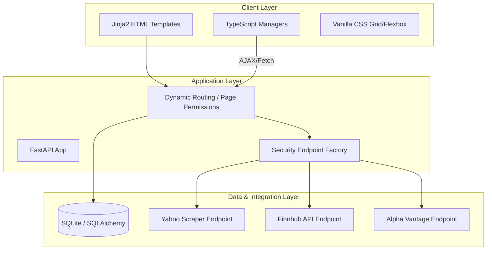
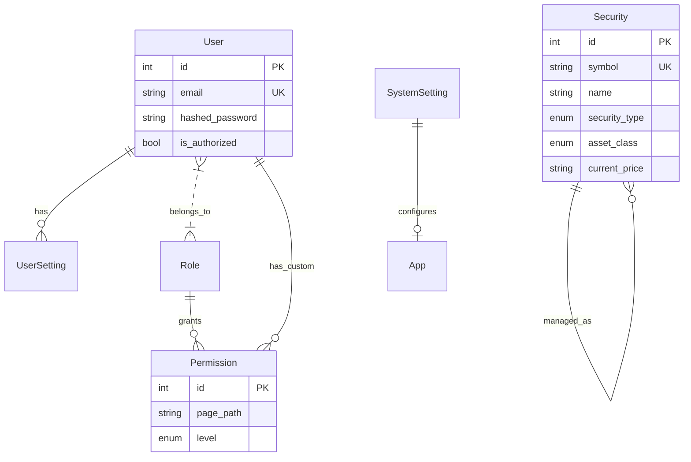

# RateEye Technical Architecture & Design

## 1. Executive Summary
RateEye is a high-performance yield tracking and security maintenance application built with a modern, layered architecture. It provides real-time security data lookups, bulk operations, and localized administrative controls. The system is designed for extensibility, allowing for easy integration of new security data providers and administrative activities.

## 2. Technology Stack
- **Backend:** [FastAPI](https://fastapi.tiangolo.com/) (Python 3.14+)
- **Database:** [SQLite](https://sqlite.org/) with [SQLAlchemy](https://www.sqlalchemy.org/) ORM
- **Frontend:** [Jinja2](https://palletsprojects.com/p/jinja/) Templates, [TypeScript](https://www.typescriptlang.org/) (ES6+), Vanilla CSS
- **Data Fetching:** `yfinance`, `curl_cffi` (impersonation), and various REST APIs
- **Tooling:** `npm` for TypeScript compilation, `pytest` for unit testing

## 3. High-Level System Architecture

## 4. Component Architecture

### 4.1. Maintenance Activity Pattern
All administrative pages (Securities, Users, Roles, Permissions) follow a standardized "Maintenance Activity" architectural pattern.

- **Base Template (`maintenance_activity_base.html`):** Defines a two-vertical-panel layout.
    - **Browse Panel (BP):** Searchable table for record selection.
    - **Maintenance Panel (MP):** Form for record viewing and editing.
- **Base Manager (`maintenance_activity.ts`):** An abstract TypeScript class handling common UI lifecycle events (Selection, Dirty Checking, Save/Delete AJAX, State Management).
- **Title Panel (TP):** Contains the Page Title and a standardized **Button Bar Panel (BBP)** for CRUD and Bulk actions.

### 4.2. Security Data Provider Strategy
The application uses the **Strategy Pattern** to handle different security data sources.

- **`BaseSecurityEndpoint`:** Abstract base class defining `search` and `lookup` interfaces.
- **`YahooScraperEndpoint`:** Default provider using `curl_cffi` for browser impersonation and `yfinance` for data mapping. Includes virtual fallback for missing tickers.
- **`FinnhubEndpoint` / `AlphaVantageEndpoint`:** API-key based providers for high-reliability data.

## 5. Data Model

## 6. Key Design Standards

### 6.1. UI/UX Principles
- **Full-Width Layout:** Content expands to fill the browser window.
- **Responsive Panels:** Browse Panel (1/3) and Maintenance Panel (2/3) support internal scrolling.
- **Status & Error Panel (SEP):** Dedicated area at the bottom for AJAX feedback and validation errors (max 25% height).
- **Help Indicators:** Standardized `?` SVG icons positioned to the right of labels, opening instructional modals.

### 6.2. Security & Permissions
- **Granular RBAC:** Access is controlled via path-based permissions stored in the database.
- **Sub-path Inheritance:** APIs (e.g., `/search`) automatically inherit permissions from their parent maintenance pages.
- **Impersonation Prevention:** Backend scrapers use `curl_cffi` to mimic standard browser signatures to avoid anti-bot blocks.

## 7. Operational Design
- **Localization:** All UI strings are managed in `translations.json` (English and Spanish supported).
- **Logging:** Centralized rotating file log (`logs/RateEye.log`) with adjustable verbosity in System Settings.
- **Deployment:** TypeScript assets must be compiled via `npm run build` before restarting the FastAPI backend.
