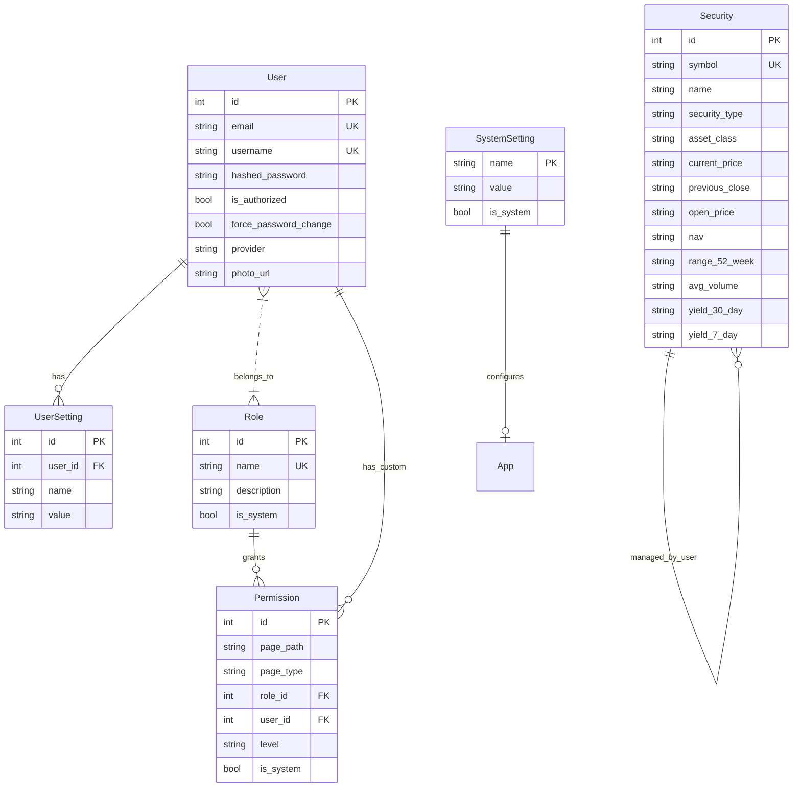

# RateEye Technical Architecture & Design

## 1. Executive Summary
RateEye is a high-performance yield tracking and security maintenance application built with a modern, layered architecture. It provides real-time security data lookups, bulk operations, and localized administrative controls.

## 2. Technology Stack
- **Backend:** [FastAPI](https://fastapi.tiangolo.com/) (Python 3.14+)
- **Database:** [SQLite](https://sqlite.org/) with [SQLAlchemy](https://www.sqlalchemy.org/) ORM
- **Frontend:** [Jinja2](https://palletsprojects.com/p/jinja/) Templates, [TypeScript](https://www.typescriptlang.org/) (ESNext), Vanilla CSS
- **Data Fetching:** `yfinance`, `curl_cffi` (impersonation), and various REST APIs
- **Tooling:** `npm` for TypeScript compilation, `pytest` for unit testing

## 3. Folder Structure (Best Practices)
The project follows a standard "src layout" to ensure clear separation between source code, tests, and data.

```
/
├── .gitignore              # Git ignore rules (node_modules, data, etc. are excluded)
├── README.md               # Basic project info and quick start
├── VERSION                 # Current application version
├── package.json            # Node.js dependencies and build scripts
├── tsconfig.json           # TypeScript configuration
├── pyproject.toml          # Python project configuration
├── pytest.ini              # Test configuration
├── requirements.txt        # Python dependencies
├── install.py              # Automated installation and deployment script
├── data/                   # Persistent storage (SQLite .db files)
├── doc/                    # Technical documentation
├── scripts/                # Dev/Ops automation scripts (release, milestone)
├── src/                    # Source code root
│   ├── frontend/           # TypeScript source files
│   └── rateeye/            # Main Python package
│       ├── main.py         # Application entry point and API routes
│       ├── database.py     # Data models and session management
│       ├── i18n.py         # Internationalization logic
│       ├── locales/        # Translation JSON files
│       ├── metadata/       # Activity-specific UI metadata
│       ├── static/         # Compiled JS, CSS, and uploaded assets
│       └── templates/      # HTML templates (Jinja2)
└── tests/                  # Unit and integration tests
```

## 4. Component Architecture

### 4.1. Maintenance Activity Pattern
Administrative pages follow a standardized pattern for consistency and rapid development.
- **`maintenance_activity_base.html`:** Implements a two-vertical-panel layout (Browse vs. Maintenance).
- **`MaintenanceActivityManager` (TS):** Base class for handling CRUD lifecycle events via AJAX.
- **Title Panel (TP):** Split into a Label Panel (LP) and a Button Bar Panel (BBP) for centralized actions.

### 4.2. Security Data Provider Strategy
...
## 5. Data Model & Segregation

### 5.1. System vs. User Data
RateEye distinguishes between **System Data** (distributed with the application) and **User Data** (created and maintained by the end-user).

- **System Data (`is_system=True`):**
    - **Default Roles:** `Admin` and `User` roles.
    - **Initial Permissions:** Standardized access control for all application pages.
    - **Core Settings:** Baseline configurations like `log_lines` and `version`.
    - *Purpose:* Provides the foundational environment required for the application to function. System data is typically protected from deletion to ensure system stability.

- **User Data (`is_system=False`):**
    - **Users:** Account information for all registered users.
    - **User Settings:** Personalizations like profile photos and language preferences.
    - **Securities:** The master list of tickers, names, and yields managed by the user.
    - **Custom Roles/Permissions:** Any additional access control entities defined by an administrator.
    - *Purpose:* Holds the personalized data and configuration that makes the application useful for a specific user or organization.

### 5.2. Persistence
All data is persisted in a local **SQLite** database file (`data/rateeye.db`).
- **Backup/Restore:** Users can use the built-in Export/Import functionality to migrate their data.
- **Relational Integrity:** Foreign key constraints ensure that deleting a user or role correctly handles associated permissions and settings.


- **Granular RBAC:** Permissions are tied to page paths and roles/users.
- **Sub-path Inheritance:** APIs automatically inherit permissions from their parent pages.
- **AJAX Validation:** All destructive or modifying actions are validated on the backend.
